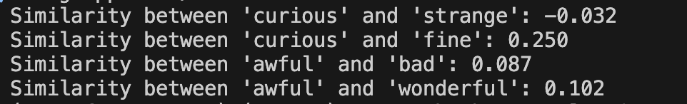

# 1830 Transformer and Embedding Model

This repository contains a personal learning project focused on training a transformer model on religious and historical texts from the 1830s, particularly the Book of Mormon. The project demonstrates how to train a language model from scratch and extract the embedding layer to create a standalone embedding model.

## Project Overview

This project was created to:
1. Learn about transformer architecture implementation
2. Train a language model on historical religious texts
3. Extract and use the embedding layer for semantic search and text analysis
4. Better understand how embedding models represent language from specific time periods and contexts

## Dataset

The training data includes:
- The Book of Mormon (1830 edition)
- Webster's 1828 Dictionary
- Lady of Perth novel

The code currently only implements the Book of Mormon, but the other texts can be found in the raw_data folder. 

These texts were chosen to create embeddings that accurately represent language usage and context from the early 19th century.

## Training the Transformer

To train the transformer model yourself:

1. Clone this repository
```bash
git clone https://github.com/yourusername/1828-embedding-model.git
cd transformer-1830
```

2. Install dependencies
```bash
pip install -r requirements.txt
```

3. Modify the hyperparameters in config.py

4. Train the model
```bash
python transformers/TokenTransformer.py
```


## Extracting the Embedding Model

After training, you can extract the embedding layer to create a standalone embedding model:

```bash
python em_extraction.py
```

## Using the Embedding Model

Once extracted, you can try the embedding model using evaluations/generate_embeddings.py

### Interesting findings
As you can see below, the embedding model reflects the 1830 meanings of "curious" and "awful", which differ from today's.  



## Future Work

Future improvements to this project may include:
- Expanding the training corpus with more 19th century texts
- Fine-tuning the model on specific domains
- Implementing more advanced transformer architectures
- Creating visualization tools for the embeddings
